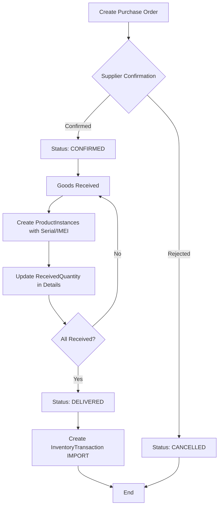
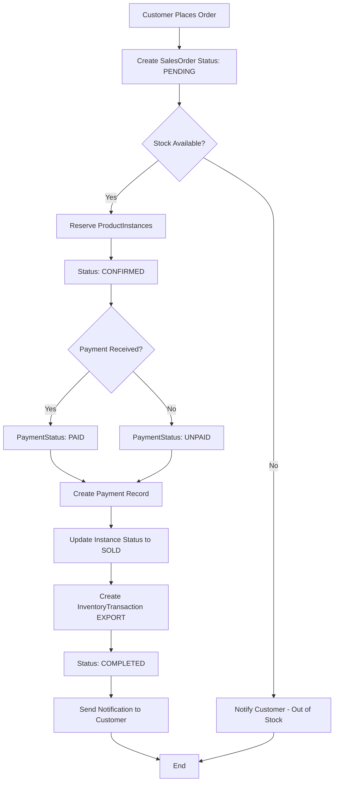
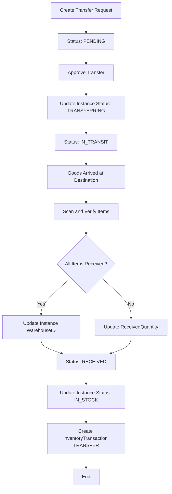
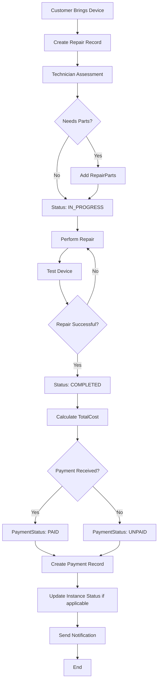
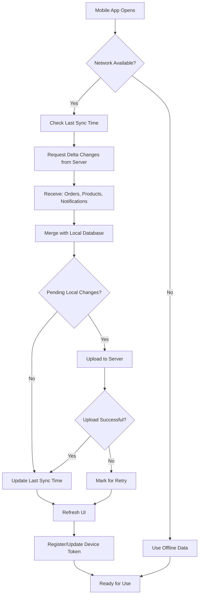

# WMS LA - Entity Relationship Diagram

## Database Schema Visual Representation

```mermaid
erDiagram
    User ||--o{ UserPermission : has
    Permission ||--o{ UserPermission : granted_to
    User ||--o{ Warehouses : manages
    User ||--o{ Notifications : receives
    User ||--o{ DeviceTokens : owns
    User ||--o{ AuditLogs : performs
    User ||--o{ PurchaseOrders : creates
    User ||--o{ SalesOrders : creates
    User ||--o{ Repairs : performs_as_technician
    User ||--o{ StockTransfers : creates
    
    Categories ||--o{ Components : contains
    Components ||--o{ ProductInstances : has_instances
    
    Warehouses ||--o{ ProductInstances : stores
    Warehouses ||--o{ PurchaseOrders : receives_to
    Warehouses ||--o{ SalesOrders : ships_from
    Warehouses ||--o{ InventoryTransactions : records
    
    Suppliers ||--o{ PurchaseOrders : supplies
    PurchaseOrders ||--o{ PurchaseOrderDetails : contains
    Components ||--o{ PurchaseOrderDetails : ordered_as
    
    Customers ||--o{ SalesOrders : places
    SalesOrders ||--o{ SalesOrderDetails : contains
    Components ||--o{ SalesOrderDetails : sold_as
    ProductInstances ||--o{ SalesOrderDetails : specific_item
    
    Customers ||--o{ Repairs : requests
    Repairs ||--o{ RepairParts : uses
    Components ||--o{ RepairParts : replaced_with
    ProductInstances ||--o{ Repairs : repairs_specific
    
    StockTransfers ||--o{ StockTransferDetails : contains
    ProductInstances ||--o{ StockTransferDetails : transferred
    
    Components ||--o{ InventoryTransactions : tracks
    ProductInstances ||--o{ InventoryTransactions : specific_tracking
    
    Customers ||--o{ Payments : pays
    Suppliers ||--o{ Payments : receives_payment
    User ||--o{ Payments : processes

    User {
        uuid UserID PK
        varchar Username
        varchar Password
        varchar Email
        varchar PhoneNumber
        varchar Role
        boolean IsActive
        timestamp CreatedAt
        timestamp UpdatedAt
        timestamp DeletedAt
    }
    
    Permission {
        uuid PermissionID PK
        varchar PermissionName
        timestamp CreatedAt
        timestamp UpdatedAt
        timestamp DeletedAt
    }
    
    UserPermission {
        uuid UserPermissionID PK
        uuid UserID FK
        uuid PermissionID FK
        timestamp CreatedAt
        timestamp UpdatedAt
        timestamp DeletedAt
    }
    
    Categories {
        uuid CategoryID PK
        varchar CategoryName
        timestamp CreatedAt
        timestamp UpdatedAt
        timestamp DeletedAt
    }
    
    Components {
        uuid ComponentID PK
        varchar SKU
        varchar ComponentName
        uuid CategoryID FK
        varchar Unit
        varchar ImageURL
        decimal BasePrice
        decimal SellPrice
        boolean IsSerialized
        timestamp CreatedAt
        timestamp UpdatedAt
        timestamp DeletedAt
    }
    
    ProductInstances {
        uuid InstanceID PK
        uuid ComponentID FK
        uuid WarehouseID FK
        varchar SerialNumber
        varchar PartNumber
        varchar IMEI1
        varchar IMEI2
        varchar Status
        decimal ActualImportPrice
        timestamp ImportDate
        text Notes
        timestamp CreatedAt
        timestamp UpdatedAt
        timestamp DeletedAt
    }
    
    Warehouses {
        uuid WarehouseID PK
        varchar WarehouseName
        varchar Address
        varchar City
        varchar District
        varchar Ward
        varchar PhoneNumber
        uuid ManagerUserID FK
        boolean IsActive
        timestamp CreatedAt
        timestamp UpdatedAt
        timestamp DeletedAt
    }
    
    Suppliers {
        uuid SupplierID PK
        varchar SupplierCode
        varchar SupplierName
        varchar ContactPerson
        varchar PhoneNumber
        varchar Email
        varchar Address
        varchar City
        varchar TaxCode
        varchar BankAccount
        varchar BankName
        text Notes
        boolean IsActive
        timestamp CreatedAt
        timestamp UpdatedAt
        timestamp DeletedAt
    }
    
    Customers {
        uuid CustomerID PK
        varchar CustomerCode
        varchar CustomerName
        varchar PhoneNumber
        varchar Email
        varchar Address
        varchar City
        varchar District
        varchar Ward
        date DateOfBirth
        varchar Gender
        varchar CustomerType
        varchar TaxCode
        text Notes
        boolean IsActive
        timestamp CreatedAt
        timestamp UpdatedAt
        timestamp DeletedAt
    }
    
    PurchaseOrders {
        uuid PurchaseOrderID PK
        varchar OrderCode
        uuid SupplierID FK
        uuid WarehouseID FK
        timestamp OrderDate
        date ExpectedDeliveryDate
        date ActualDeliveryDate
        varchar Status
        decimal TotalAmount
        decimal DiscountAmount
        decimal FinalAmount
        uuid CreatedByUserID FK
        text Notes
        timestamp CreatedAt
        timestamp UpdatedAt
        timestamp DeletedAt
    }
    
    PurchaseOrderDetails {
        uuid PurchaseOrderDetailID PK
        uuid PurchaseOrderID FK
        uuid ComponentID FK
        int Quantity
        decimal UnitPrice
        decimal TotalPrice
        int ReceivedQuantity
        text Notes
        timestamp CreatedAt
        timestamp UpdatedAt
        timestamp DeletedAt
    }
    
    SalesOrders {
        uuid SalesOrderID PK
        varchar OrderCode
        uuid CustomerID FK
        uuid WarehouseID FK
        timestamp OrderDate
        varchar Status
        decimal TotalAmount
        decimal DiscountAmount
        decimal FinalAmount
        varchar PaymentStatus
        varchar PaymentMethod
        uuid CreatedByUserID FK
        text Notes
        timestamp CreatedAt
        timestamp UpdatedAt
        timestamp DeletedAt
    }
    
    SalesOrderDetails {
        uuid SalesOrderDetailID PK
        uuid SalesOrderID FK
        uuid ComponentID FK
        uuid InstanceID FK
        int Quantity
        decimal UnitPrice
        decimal TotalPrice
        decimal DiscountPercent
        decimal DiscountAmount
        decimal FinalPrice
        text Notes
        timestamp CreatedAt
        timestamp UpdatedAt
        timestamp DeletedAt
    }
    
    StockTransfers {
        uuid TransferID PK
        varchar TransferCode
        uuid FromWarehouseID FK
        uuid ToWarehouseID FK
        timestamp TransferDate
        date ExpectedReceiveDate
        date ActualReceiveDate
        varchar Status
        uuid CreatedByUserID FK
        uuid ReceivedByUserID FK
        text Notes
        timestamp CreatedAt
        timestamp UpdatedAt
        timestamp DeletedAt
    }
    
    StockTransferDetails {
        uuid TransferDetailID PK
        uuid TransferID FK
        uuid InstanceID FK
        uuid ComponentID FK
        int Quantity
        int ReceivedQuantity
        text Notes
        timestamp CreatedAt
        timestamp UpdatedAt
        timestamp DeletedAt
    }
    
    Repairs {
        uuid RepairID PK
        varchar RepairCode
        uuid CustomerID FK
        uuid InstanceID FK
        uuid ComponentID FK
        text ProblemDescription
        timestamp RepairDate
        date ExpectedCompletionDate
        date ActualCompletionDate
        varchar Status
        uuid TechnicianUserID FK
        decimal RepairCost
        decimal PartsCost
        decimal TotalCost
        varchar PaymentStatus
        varchar WarrantyType
        text Notes
        timestamp CreatedAt
        timestamp UpdatedAt
        timestamp DeletedAt
    }
    
    RepairParts {
        uuid RepairPartID PK
        uuid RepairID FK
        uuid ComponentID FK
        uuid InstanceID FK
        int Quantity
        decimal UnitPrice
        decimal TotalPrice
        text Notes
        timestamp CreatedAt
        timestamp UpdatedAt
        timestamp DeletedAt
    }
    
    InventoryTransactions {
        uuid TransactionID PK
        varchar TransactionCode
        varchar TransactionType
        uuid ReferenceID
        uuid WarehouseID FK
        uuid ComponentID FK
        uuid InstanceID FK
        int Quantity
        timestamp TransactionDate
        uuid CreatedByUserID FK
        text Notes
        timestamp CreatedAt
    }
    
    Payments {
        uuid PaymentID PK
        varchar PaymentCode
        varchar ReferenceType
        uuid ReferenceID
        uuid CustomerID FK
        uuid SupplierID FK
        timestamp PaymentDate
        varchar PaymentMethod
        decimal Amount
        varchar Status
        varchar TransactionID
        text Notes
        uuid CreatedByUserID FK
        timestamp CreatedAt
        timestamp UpdatedAt
        timestamp DeletedAt
    }
    
    Notifications {
        uuid NotificationID PK
        uuid UserID FK
        varchar Title
        text Message
        varchar NotificationType
        varchar ReferenceType
        uuid ReferenceID
        boolean IsRead
        timestamp ReadAt
        timestamp CreatedAt
        timestamp DeletedAt
    }
    
    AuditLogs {
        uuid LogID PK
        uuid UserID FK
        varchar Action
        varchar EntityType
        uuid EntityID
        text OldValue
        text NewValue
        varchar IPAddress
        text UserAgent
        timestamp CreatedAt
    }
    
    DeviceTokens {
        uuid TokenID PK
        uuid UserID FK
        varchar DeviceToken
        varchar DeviceType
        varchar DeviceName
        boolean IsActive
        timestamp LastUsedAt
        timestamp CreatedAt
        timestamp UpdatedAt
    }
    
    AppSettings {
        uuid SettingID PK
        varchar SettingKey
        text SettingValue
        varchar Description
        varchar DataType
        boolean IsSystem
        timestamp CreatedAt
        timestamp UpdatedAt
    }
```

## Workflow Diagrams

### 1. Purchase Order Flow

### 2. Sales Order Flow

### 3. Stock Transfer Flow

### 4. Repair Flow

### 5. Mobile App Sync Flow

## Table Groupings by Functionality

### Core System
- User
- Permission
- UserPermission
- AuditLogs
- AppSettings

### Product Management
- Categories
- Components
- ProductInstances

### Warehouse Management
- Warehouses
- InventoryTransactions
- StockTransfers
- StockTransferDetails

### Business Partners
- Suppliers
- Customers

### Purchasing
- PurchaseOrders
- PurchaseOrderDetails

### Sales
- SalesOrders
- SalesOrderDetails

### Service & Repair
- Repairs
- RepairParts

### Financial
- Payments

### Mobile/Web Support
- Notifications
- DeviceTokens

## Key Indexes Summary

| Table | Index Name | Columns | Purpose |
|-------|-----------|---------|---------|
| User | idx_user_username | Username | Fast login lookup |
| User | idx_user_email | Email | Email search |
| Components | idx_components_sku | SKU | Product search |
| ProductInstances | idx_instances_serial | SerialNumber | Serial lookup |
| ProductInstances | idx_instances_imei1 | IMEI1 | IMEI lookup |
| SalesOrders | idx_sales_orders_code | OrderCode | Order search |
| Customers | idx_customers_phone | PhoneNumber | Customer lookup |
| InventoryTransactions | idx_inventory_trans_date | TransactionDate | Date range queries |
| Notifications | idx_notifications_user | UserID | User notifications |

## Constraints Summary

### Unique Constraints
- User: Username, Email
- Components: SKU
- ProductInstances: SerialNumber, IMEI1
- Suppliers: SupplierCode
- Customers: CustomerCode
- All Orders: OrderCode
- DeviceTokens: DeviceToken
- AppSettings: SettingKey

### Check Constraints (To be added)
- Quantity > 0 in order details
- Prices >= 0
- Dates validation (ExpectedDate >= OrderDate)

## Data Types Reference

| PostgreSQL Type | Usage | Example |
|----------------|-------|---------|
| UUID | Primary Keys, Foreign Keys | GEN_RANDOM_UUID() |
| VARCHAR(N) | Short text, codes | SKU, OrderCode |
| NVARCHAR/TEXT | Long text, Unicode | Names, Addresses, Notes |
| DECIMAL(15,2) | Money amounts | Prices, Totals |
| INT | Quantities | Stock count |
| BOOLEAN | Flags | IsActive, IsRead |
| TIMESTAMP | Date & Time | CreatedAt, OrderDate |
| DATE | Date only | DateOfBirth, DeliveryDate |

---

*This ERD represents the complete database structure for WMS LA system supporting both Mobile and Web applications.*
